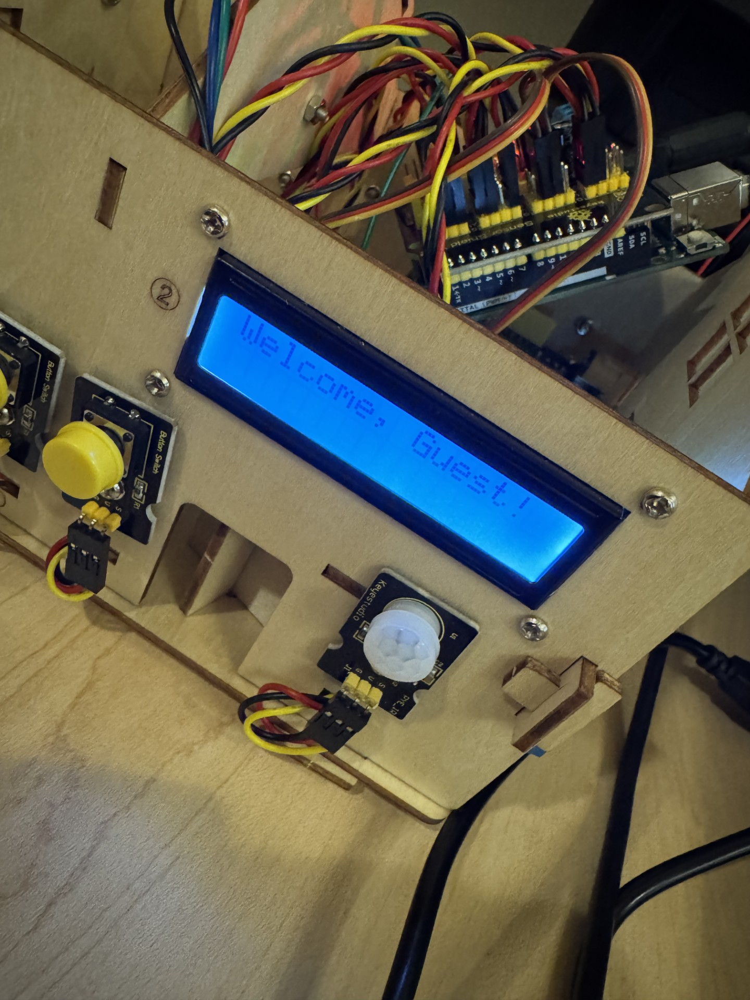

# Smart Home System using KeyeStudio components and Arduino R3 Board
- A low-cost embedded project demonstrating sensor integration, automation logic, and microcontroller based decision making.

## Components
- (Qty, Type)

- (2, Actuators)
- (1, I2C LCD)
- (2, Button Switches)
- (2, LEDs yellow && white)
- (1, Relay Module)
- (1, Motion detection sensor)
- (1, Passive piezo buzzer)
- (1, Gas/hazardous odor sensor)

## References
- https://docs.keyestudio.com/projects/KS0085/en/latest/
- Official Arduino Book
- Previous Arduino Projects

## In the process
 - Assembled the mini smart home frame and mounted sensors and module into position. 

 - After attaching, I made sure all components were aligned properly for accurate sensing.

 - Here I ensured wiring and pin mapping accuracy, neatly running wires to correct pins and checking for stable connections.

 - A picture of wires ran neatly as well as connected to the correct pins. E.g. Digital, Analog, PWM, I2C etc. 

 - Ran into issues with the Keyestudio control board(not sensor shield), decided to swap out for an official Arduino.   

 - Confirmed all components are now powered, responsive and ready for firmware development.

 - Ran into more debugging, decided to rewire entire system and learned a few new things in the process.

 - Confirmed I am now able to control components inside of my program.

 - Here I adjusted the potentiometer for proper signal calibration(better contrast).
