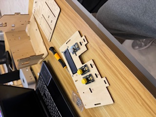
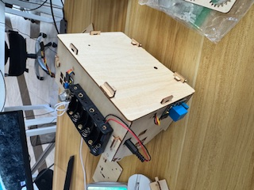
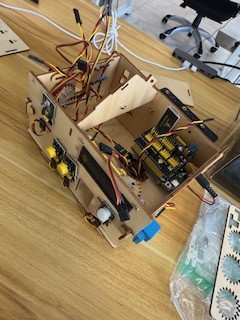
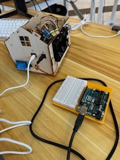
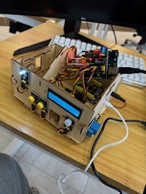
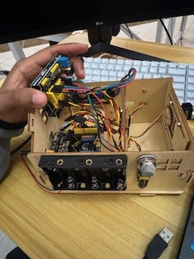
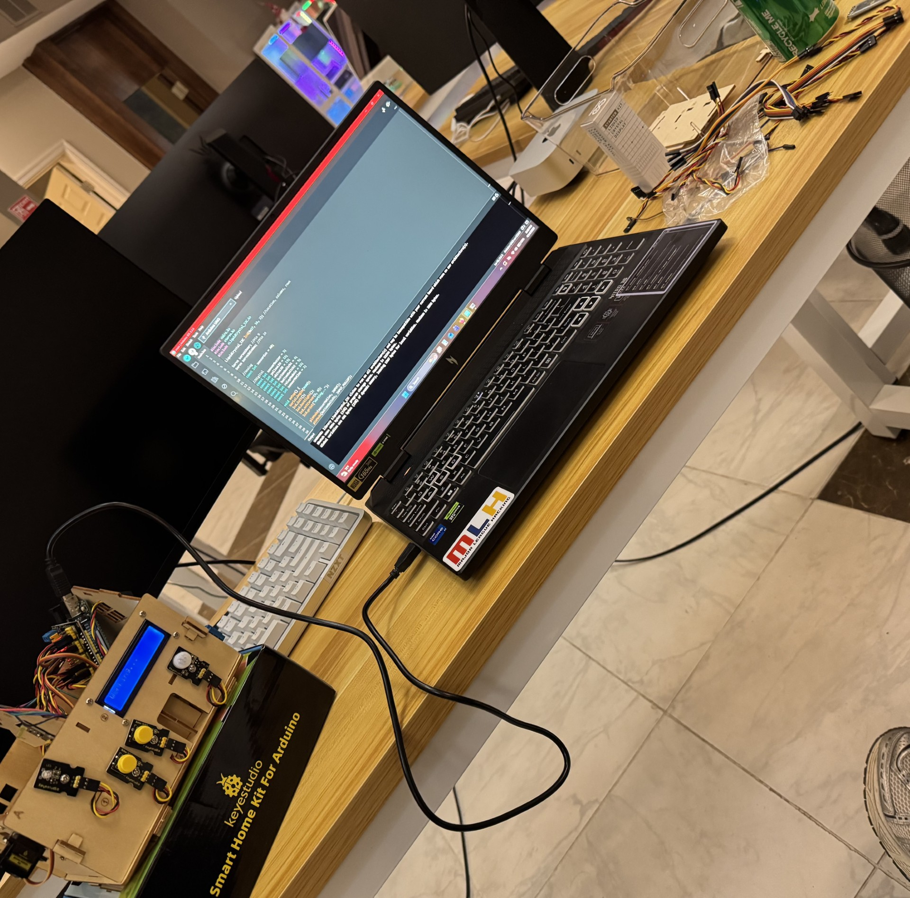
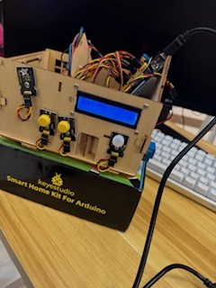

# Smart Home using KeyeStudio components and Arduino R3 Board

## Components
- (Qty, Type)

- (2, Actuators)
- (1, I2C LCD)
- (2, Button Switches)
- (2, LEDs yellow && white)
- (1, Relay Module)
- (1, Motion detection sensor)
- (1, Passive piezo buzzer)
- (1, Gas/hazardous odor sensor)

## References
- https://docs.keyestudio.com/projects/KS0085/en/latest/
- Official Arduino Book
- Previous Arduino Projects

## In the process
 - In this first image, I began assembling the mini frame and attaching components.

 - Next, shows the mini smart home fully assembled with components attached.

 - In this third image, I am connecting one end of each wire to a sensor while neatly running the opposite end towards the microcontroller.

 - Here I not only make sure things are wired neatly but that they are also connected to the correct pins. E.g. Digital, Analog, PWM, I2C etc. 

 - After getting everything wired, I proceeded to install necessary software and begin testing. Instantly, I found myself debugging. Due to previous projects with Arduino IDE, I noticed right away that my computer was not picking up a USB connection from the microcontroller. The original microcontroller being used in the photos is a KeyeStudio PLUS control board with a Keyestudio sensor shield v5.2 on top and USB-C for the port. After trying manual driver installation, a few other possible solutions and remembering that my deadline was approaching, I decided to move on with what I knew. I knew if I could get the Keyestudio sensor shield to connect to my arduino R3 board, then I would have a garunteed connection from my R3 to my computer and Arduino IDE. So, I did just that and was able to get to the next step.     

 - You can now see I have taken the sensor shield and connected it to my arduino R3 with power coming in through the USB-B cord. At this point in the project I am now able to see a connection from the control board to my computer along with a connection from the control board through the sensor shield and to each component. 

 - Here we have image 7

 - Here we have image 8

 - Here I used a small screwdriver to adjust the potentiometer for a better contrast.
